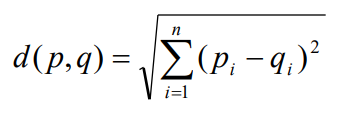

# Inteligência Artificial - Trabalho 04: k-Nearest Neighbour (KNN)

Fundação da Universidade Regional de Blumenau

Alunos: 
* [Bruno Geisler Vigentas](https://github.com/bvigentas)
* [Francisco Lucas Sens](https://github.com/franciscosens)
* [Gustavo Westarb](https://github.com/GustavoWestarb)
* [William Lopes da Silva](wiiulopes)

[Conteúdo](assets/Conteúdo/Uni04_AprendizadoSupervisionadoKNNeSVM.pdf)


Neste trabalho estamos criando um classificador k-Nearest Neighbour, um dos classificadores mais simples. A tarefa a ser realizada é a seguinte:

Dado um conjunto de dados, você quer construir um programa que prevê novos exemplos para uma classe. Por exemplo, dado um conjunto de dígitos escritos à mão, você quer construir um programa que reconhece automaticamente o CEP das cartas.

Implemente um classificador **1-NN** usando a distância Euclidiana. 



Note que todos os conjuntos de dados usam vetores de linha. A função deve ser algo parecido com:

```
def meuKnn(dadosTrain, rotuloTrain, dadosTeste, k)
%Para cada exemplo de teste
    % Calcule a distância entre o exemplo de teste e os dados de treinamento
    % Ordene as distâncias. A ordem iX de cada elemento ordenado é importante:
    % [distOrdenada ind] = sort(...);
    % O rótulo previsto corresponde ao rótulo do exemplo mais próximo (iX(1))
```

Para testar se você implementou a função corretamente, baixe o arquivo **grupoDados1.mat** - cada arquivo **.mat** contém 4 variáveis que são: grupoTest, grupoTrain, testRots, trainRots. Para baixar os arquivos **.mat** no Python você pode fazer o seguinte

```
import scipy.io as scipy
mat = scipy.loadmat('grupoDados1.mat')
grupoTest = mat['grupoTest']
```

Então, verifique quantas classes foram previstas corretamente, isto é chamado de acurácia (accuracy):

```
rotuloPrevisto = meuKnn(grupoTrain, trainRots, grupoTest, 1);
estaCorreto = rotuloPrevisto == testRots;
numCorreto = sum(estaCorreto);
totalNum = length(testRots);
acurácia = numCorreto / totalNum
```

A acurácia deve ser de 96%. Agora, vamos estender a função a um classificador k-NN:

```
def meuKnn(dadosTrain, rotuloTrain, dadosTeste, k)
% Para cada exemplo de teste
    % Calcule a distância entre o exemplo de teste e os dados de treinamento    
    % Ordene as distâncias. A ordem iX de cada elemento ordenado é importante:
    % [distOrdenada ind] = sort(...);
    % Obter os rótulos correspondentes aos exemplos mais próximos k
    % Agora, a moda dos rótulos correspondentes são os rótulos previstos(você pode usar a função mode).
```

Teste novamente no conjunto de dados 1 (**grupoDados1.mat**) e utilize k = 10 para uma acurácia igual a 94%.

É sempre bom visualizar graficamente seus dados. Para fazer isso, crie a seguinte função:

```
def visualizaPontos(dados, rotulos, d1, d2)
plot(dados(rotulos==1, d1), dados(rotulos==1, d2), color='red', marker='^');
plot(dados(rotulos==2, d1), dados(rotulos==2, d2), color='blue', marker='+');
plot(dados(rotulos==3,d1), dados(rotulos==3, d2), color='green', marker='o');
```

Nesta função, d1 e d2 denotam as dimensões que você deseja visualizar, isto é 1 e 2 respectivamente

## Grupo de Dados 01:

O **grupoDados1** é um conjunto de dados de flores. Para mais informações consulte:

http://archive.ics.uci.edu/ml/datasets/Iris .

**Q1.1:** Qual é a acurácia máxima que você consegue da classificação?

**Q1.2:** É necessário ter todas as características (atributos) para obter a acurácia máxima para esta classificação?

## Grupo de Dados 02:

O **Grupo de Dados 2** é um problema que visa prever a origem do vinho em base aos seus componentes químicos. As características são:

1. Álcool
2. Ácido málico
3. Cinzas
4. Alcalinidade das cinzas
5. Magnésio
6. Fenóis totais
7. Flavonóides
8. Fenóis não flavonóides
9. Proantocianinas
10. Intensidade de cor
11. Tonalidade
12. OD280 / OD315 de vinhos diluídos
13. Prolina

**Q2.1:** Aplique seu kNN a este problema. Qual é a sua acurácia de classificação?

**Q2.2:** A acurácia pode ser igual a 98% com o kNN. Descubra por que o resultado atual é muito menor. Ajuste o conjunto de dados ou k de tal forma que a acurácia se torne 98% e explique o que você fez e por quê.

## Grupo de Dados 03:

**Q3.1:** Aplique o kNN ao problema usando k = 1. Qual é a acurácia na classificação?

**Q3.2:** A acurácia pode ser igual a 92% com o kNN. Descubra por que o resultado atual é muito menor. Ajuste o conjunto de dados ou k de tal forma que a acurácia se torne 92% e explique o que você fez e por quê.


**Observações:**
* No código deve ter 4 funções: **dist**, **meuKnn**, **visualizaPontos**, **normalizacao** e 3 scripts: **demoD1**, **demoD2**, **demoD3** (todas com comentários do que foi feito), e responda as perguntas nos comentários de cada script.
* Coloque o nome dos integrantes do grupo na primeira linha dos scripts.
* Envie apenas uma versão para todo o grupo, especificando também os nomes de todos os outros colegas.
    * T4_Aluno1_Aluno2_Aluno3......zip